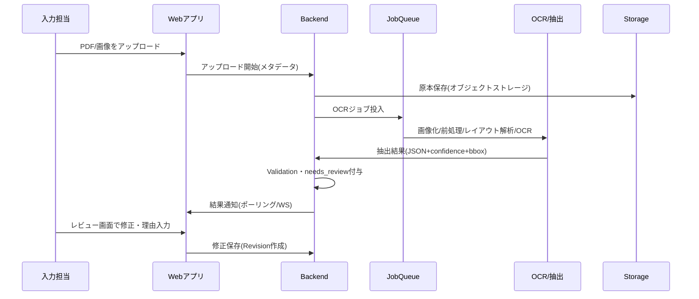
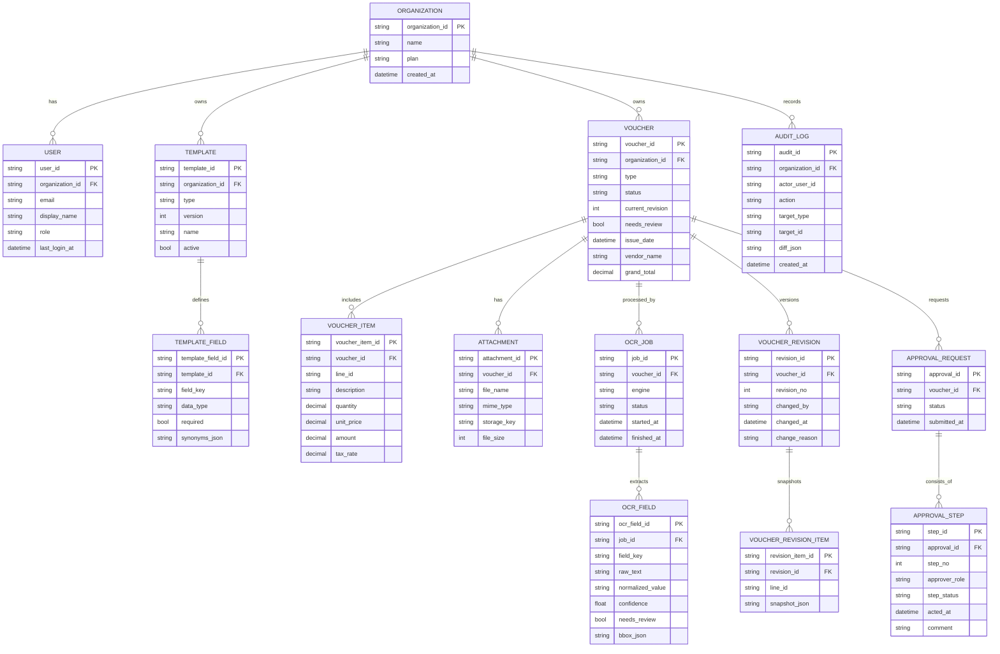

# 伝票転記支援システム 詳細仕様書 spec.md

## エグゼクティブサマリ

本仕様書は、紙・PDF・画像の伝票（請求書・納品書・仕訳伝票等）を、OCRと人手の確認を組み合わせて「正確に」「監査可能に」「再現性のある形で」データ化し、CSV/Excel/API経由で会計・基幹システムへ連携するための、開発可能レベルの詳細仕様を定義する。背景として、伝票情報の手作業転記は時間がかかり、繁忙期に負担が増大し、数値・日付の入力ミスが起こりやすいという課題がある。fileciteturn0file0

OCR処理は「ページ全体を一括OCR」ではなく、PDF→画像化（推奨 300dpi 以上）→レイアウト解析→表領域とテキスト領域の分離→ブロック単位OCR→位置情報（bbox）と信頼度（confidence）保持→ラベル-値対応付け→正規化（必要に応じてLLM）→整合性チェック（Validation）→低信頼箇所は `needs_review` として人手確認、という段階的方式を標準パイプラインとする。fileciteturn0file0 なお画像品質はOCR精度の主要因であり、Tesseractの公式ドキュメントでも少なくとも300dpi相当が望ましい旨が示されている。citeturn2search14

OCRエンジン／サービスは、オンプレ（OSS）とクラウド（商用API）の両選択肢を前提にした「差し替え可能アーキテクチャ」とし、クラウド候補としては、請求書から主要フィールドと明細を抽出しJSONを返す Azureの事前構築請求書モデル、請求書・領収書を解析し `SummaryFields` と `LineItemGroups` を返す Amazon Textract AnalyzeExpense、調達向けに請求書等の非構造化ドキュメントを構造化する Google系のDocument AIソリューションを比較対象とする。citeturn0search1turn0search2turn0search6turn0search4 OSS候補としては PaddleOCR（多言語・日本語対応の記載あり）、EasyOCR（80+言語対応の記載あり）、Tesseract（学習済み日本語データが公開）を候補に含める。citeturn1search1turn2search0turn2search1turn2search13

外部連携は「未指定」としつつ、会計連携APIの公式仕様として freee 会計API（OAuth2、HTTPSのみ、会計機能のAPI提供の説明あり）および マネーフォワード クラウド API（OAuthやAPIキー等の概念説明が公式に公開）を参照し、エクスポート面では「CSV/Excel/汎用JSON＋（任意）個社別変換」を標準とする。citeturn0search7turn0search11turn6search8 将来拡張として、デジタル庁が管理する日本のデジタルインボイス標準仕様 JP PINT（Peppol準拠）への対応を選択肢に含める。citeturn6search3

セキュリティは、OIDC/OAuth2に基づく認証、RBACによる認可、TLS（例：TLS1.3）による通信保護、保存時暗号化、改ざん耐性のある監査ログを必須とする。OAuth2・OIDC・JWT・TLSの仕様はそれぞれ標準仕様として公開されている。citeturn4search0turn2search3turn4search1turn5search0 さらに、OWASP Top 10を脅威観点のベースライン、ログ設計はOWASPのLoggingガイダンス等を参照する。citeturn3search1turn4search2 個人情報を含み得るため、個人情報保護委員会の法令・ガイドライン群および漏えい時の報告・通知義務に関する政府広報等をコンプライアンス要件の参照点とする。citeturn5search1turn5search13

## 目的・背景とスコープ

### 目的・背景

目的は、伝票の転記作業を「自動化できるところは自動化し、判断が必要な箇所は人間が確認する」形で、処理時間・入力ミス・属人性を削減し、監査対応（いつ・誰が・何を根拠に修正したか）まで含めて業務品質を高めることである。手作業転記が多く、繁忙期に負担増、入力ミスが起きやすいという課題は、アップロード資料でも明確に整理されている。fileciteturn0file0 さらに、伝票フォーマットが統一されていないことが自動化を難しくする主要因である点も示されているため、本仕様では「テンプレート型（固定帳票）」と「テンプレートレス型（ラベル・表構造推定）」の両モードを前提にする。fileciteturn0file0

### スコープ

本システムは「伝票画像／PDF → 構造化データ → 確認・承認 → 出力・連携」までを扱う。外部システム（会計・ERP等）へは、MVPではCSV/Excel/JSONのエクスポートを必須とし、API連携は「将来拡張（ただし設計は先に枠を用意）」とする。会計APIとしては、OAuth2を用いるfreee 会計APIが公式に公開されている。citeturn0search7turn0search11 マネーフォワードも開発者向けにOAuthやAPIキーの概要を含むAPIドキュメントを公開している。citeturn6search8

### 対象ユーザー

対象ユーザーは以下を想定する（組織単位のテナント制）。

| ロール | 主な担当 | 代表的操作 | 備考 |
|---|---|---|---|
| 入力担当（Operator） | 伝票登録・OCR起動・一次確認 | 取込、編集、差分対応、差戻し対応 | 伝票メタデータ修正権限 |
| 承認者（Approver） | 承認／否認／差戻し | 承認アクション、コメント | ワークフロー段階により権限制約 |
| 管理者（Admin） | ユーザー・権限・テンプレート・連携設定 | テンプレート管理、OCR設定、監査設定 | 組織全体設定 |
| 監査閲覧者（Auditor/ReadOnly） | 監査ログ・履歴参照 | 閲覧・エクスポート | データ改変不可 |
| 連携用サービスアカウント（Integration Bot） | 自動エクスポート／連携 | API呼出・Webhooks | 期限付きトークン推奨 |

### 未指定事項

未指定の点は以下として扱い、意思決定が必要な項目を明示する。

| 項目 | 状態 | 仕様上の扱い（暫定） |
|---|---|---|
| 連携対象会計ソフト（freee / MF / 勘定奉行など） | 未指定 | 汎用エクスポート＋コネクタ拡張で吸収（後述） |
| 利用ユーザー数・同時接続数 | 未指定 | パフォーマンス要件は暫定値を提示（後述） |
| 伝票件数（/日、/月） | 未指定 | OCRジョブは非同期前提、キューで平準化 |
| 保存年数（伝票・監査ログ） | 未指定 | 初期は「伝票7年、監査ログ7年」を暫定（要確認） |
| 対象業界（物流/製造/一般事務など） | 未指定 | 汎用項目＋テンプレート拡張で対応 |
| 導入形態（SaaS/オンプレ/閉域） | 未指定 | 両対応可能な構成（OIDC差替、OCR差替） |

## 対象伝票とデータ要件

### 対応する伝票フォーマット

本要件では具体の伝票種類が未指定のため、一般的な例として「請求書」「納品書」「仕訳伝票」を標準対応フォーマットとする（将来的に輸送依頼書等を追加可能）。fileciteturn0file0

#### 標準データ項目（例）

| 種別 | ヘッダ（例） | 明細（例） | 集計（例） | 備考 |
|---|---|---|---|---|
| 請求書 | 発行日、請求書番号、取引先名、請求先住所、支払期限、振込先 | 品目名、数量、単価、金額、税区分/税率 | 小計、消費税、合計、値引き | OCRサービスが事前構築で対応する場合がある（後述）citeturn0search1turn0search2 |
| 納品書 | 納品日、納品書番号、発注番号、納品先、送付元 | 品目名、数量、単位、備考 | 合計数量（任意） | 請求書ほど標準モデル対応は少ないためテンプレート/辞書が重要 |
| 仕訳伝票 | 伝票日付、伝票番号、摘要、部門、起票者 | 借方科目、借方金額、貸方科目、貸方金額、税区分、補助科目 | 借方合計＝貸方合計 | 会計API連携時にマッピングが必要 citeturn0search7turn6search8 |

image_group{"layout":"carousel","aspect_ratio":"16:9","query":["日本 請求書 フォーマット サンプル","日本 納品書 フォーマット サンプル","仕訳伝票 フォーマット サンプル"],"num_per_query":1}

### 入力ファイル仕様

入力は以下を標準とする。

- PDF（テキストPDF／画像PDFを含む）
- 画像（JPEG/PNG/WebP、TIFFは将来拡張）

アップロード資料ではPDF（テキスト/画像）を入力として取り込み、OCRで文字情報を取得し、その後に項目の意味整理・分類、確信度が低い情報は自動転記せず確認対象にする、という思想が示されている。fileciteturn0file0  
画像化時の解像度は 300〜450dpi が推奨され、まずは300dpi推奨・傾き補正や余白除去など前処理を行う方針が記載されている。fileciteturn0file0 加えてTesseract公式でも300dpi以上相当が推奨されているため、MVPでは「300dpi相当未満の画像は警告＋自動リサイズ」を既定とする。citeturn2search14

### OCR・抽出方式の対応方針

本システムは二つの抽出方式を提供する。

- テンプレート型：帳票レイアウトが固定（例：自社指定の請求書様式）。テンプレート定義（フィールド位置 or レイアウトルール）に従い抽出。
- テンプレートレス型：帳票が多様。表構造推定（罫線検出→セル復元）またはラベル（キー）と値の近傍対応付けにより抽出。

アップロード資料でも、罫線表は線検出→セル分割→表復元、表が弱い場合は辞書でラベル候補を探し近傍スコアで値を決める、という具体策が示されている。fileciteturn0file0

クラウドOCRを使う場合、請求書・領収書については「明細行」「主要フィールド」を構造化JSONとして返す事前構築モデルが存在する。MicrosoftのDocument Intelligence請求書モデルは、複数形式（画像・スキャン・デジタルPDF等）から主要フィールドと明細を抽出し、構造化JSONを返すことが明記されている。citeturn0search1 Amazon Textractも請求書・領収書分析（AnalyzeExpense/StartExpenseAnalysis）でJSONを返し、応答は `SummaryFields` と `LineItemGroups` を含む構造であることが記載されている。citeturn0search2turn0search6 Google側も請求書・領収書等の非構造化文書を構造化データに変換する調達向けDocument AIの位置づけを示している。citeturn0search4

## 機能要件

### 主要機能一覧

要求された主要機能（手動入力、OCR自動転記、テンプレート管理、承認ワークフロー、差分検出・修正履歴、バルク入出力、監査ログ）を中核に、MVP/将来拡張のスコープを分ける。

| 機能カテゴリ | 機能 | 内容要約 | MVP | 将来拡張 |
|---|---|---|---|---|
| 伝票作成 | 手動入力 | 画面でヘッダ・明細を入力、計算補助（小計/税/合計） | ✓ |  |
| 取込 | OCR自動転記 | PDF/画像→OCR→抽出→Validation→レビュー | ✓ |  |
| テンプレート | テンプレート管理 | 伝票種別ごとの項目定義、辞書（同義語）管理 | ✓ | テンプレート自動推薦 |
| 承認 | 承認ワークフロー | 段階承認、差戻し、コメント、SLA（任意） | ✓ | 柔軟な条件分岐 |
| 履歴 | 差分検出・修正履歴 | 版管理、差分表示、ロールバック | ✓ | 文書比較UI強化 |
| 一括 | バルクインポート/エクスポート | CSV/Excel取込、検索条件で一括出力 | ✓ | 会計APIへ自動同期 |
| 監査 | 監査ログ | 重要操作の記録、改ざん耐性、追跡性 | ✓ | SIEM連携 |
| 管理 | ユーザー/権限/設定 | RBAC、OCR設定、データ保持設定 | ✓ | 組織階層（部門） |

### OCR自動転記の標準パイプライン仕様

アップロード資料にある実装方針を踏まえ、以下を標準とする。fileciteturn0file0

#### パイプライン段階

1) 取込  
PDF/画像を受け取り、オブジェクトストレージに保存。PDFはページ単位に画像化（既定 300dpi、上限 450dpi）。fileciteturn0file0

2) 前処理  
傾き補正、余白除去、コントラスト調整。伝票テンプレートが既知ならテンプレ補助（回転角推定、スケール推定）を加える。

3) レイアウト解析  
ページを「罫線表領域」と「通常テキストブロック」に分割。罫線表はセル構造を復元し、非表領域は段落/ラベルブロックで抽出する。fileciteturn0file0

4) OCR  
ページ全体一括ではなく、ブロック単位でOCR。OCR結果は文字列だけでなく、位置情報（bbox）を保持する。fileciteturn0file0  
OSS候補としてPaddleOCRは多言語・日本語を含む言語サポートの記載がある。citeturn1search1 EasyOCRも80+言語サポートを掲げている。citeturn2search0

5) キー（ラベル）と値の対応付け  
「日付」「伝票番号」「会社名」「合計」等のラベルを検出し近傍（右・下優先）から値候補を紐付け、複数候補は距離・同一行・値形式でスコアリングして決定する。fileciteturn0file0

6) 正規化（LLMは任意）  
OCR＋対応付けの結果を、正規化（数値・日付・通貨）や表記ゆれ統一に使う。ただし捏造防止として「空欄を勝手に埋めない」「不明は不明で返す」を絶対ルールとし、疑義は `needs_review=true` を付与する。fileciteturn0file0  
セキュリティ要件によりLLMをローカル運用する方針（例：ローカルLLMの利用）が資料中で示されているため、LLMは「ローカル/クラウド切替可能」とし、既定はローカル優先とする（ただしモデル名は未指定）。fileciteturn0file0

7) Validation（整合性チェック）  
必須項目欠落、数値変換可否、合計整合（小計＋税など）、明細整合（金額＝数量×単価）をチェックし、NGは `status=REVIEW/FAIL` と理由を保持する。fileciteturn0file0

8) ヒューマンレビュー  
`needs_review` の付いたフィールド／明細行、またはValidation警告がある伝票をレビュー画面で修正し、修正理由を記録。

9) 出力  
Excel固定フォーマット（ヘッダ1行＋明細別シートの2枚構成）やCSV/JSONに出力し、監査用に生テキスト・confidence・警告理由も保持する。fileciteturn0file0  
クラウドOCR利用時は、Azureの請求書モデルが主要フィールドと明細をJSONで返すこと、Textractが請求書/領収書分析でJSONを返すことが公式に示されているため、内部の正規化JSONスキーマへ変換して統一する。citeturn0search1turn0search2turn0search6

### テンプレート管理仕様

テンプレートは「取引先別・帳票種別別に異なるレイアウト」を吸収するための中核機能とする。

- テンプレート要素  
  - 対象伝票種別（invoice/delivery/journal）
  - フィールド定義（フィールド名、型、必須、正規化ルール）
  - 抽出ヒント（ラベル辞書、同義語、表見出し候補）
  - レイアウト情報（テンプレート型の場合のみ：相対領域、セル位置、許容誤差）
  - Validationルール（合計式、税計算、借貸一致）

- テンプレート版管理  
  - `template_version` を持ち、過去伝票は「当時のテンプレートバージョン」を参照（監査要件）。
  - テンプレート変更は監査ログ対象。

### 承認ワークフロー仕様

- ワークフロー概念  
  - 伝票は「データ化（入力/レビュー）」と「承認」を分離し、承認後にエクスポート可能。
  - 承認は段階（例：1次承認→最終承認）を持てる。

- 標準ステータス（伝票）  
  - `DRAFT`（下書き）
  - `OCR_PROCESSING`（OCR中）
  - `REVIEW_REQUIRED`（要確認：needs_review/Validation警告あり）
  - `READY_FOR_APPROVAL`（承認申請可能）
  - `APPROVING`（承認中）
  - `APPROVED`（承認済）
  - `REJECTED`（否認）
  - `EXPORTED`（出力/連携済）
  - `ARCHIVED`（保管）

- 標準ステータス（承認依頼）  
  - `PENDING` / `APPROVED` / `REJECTED` / `CANCELLED`

### 差分検出・修正履歴

- 版管理（Revision）  
  - 伝票の編集確定（保存）時に、ヘッダ・明細のスナップショットを版として保存。
  - OCR結果、レビューによる修正、承認アクションは全て「版＋監査ログ」に紐付ける。

- 差分表示  
  - UIは「前版 vs 現版」のフィールド差分を表示（追加/変更/削除）。
  - 明細は行ベースの同一性を `line_id`（UUID）で管理し、並び替え・挿入を許容。

### バルクインポート/エクスポート

- インポート（CSV/Excel）  
  - 伝票ヘッダ＋明細の2シート/2CSV方式を既定（アップロード資料の出力思想と整合）。fileciteturn0file0
  - 取込時にValidationし、失敗行はエラー詳細を返す。

- エクスポート  
  - 検索条件（期間、取引先、ステータス等）で一括エクスポート。
  - 形式：CSV、Excel、JSON（内部正規化スキーマ）、（将来）会計ソフト別フォーマット。

- 会計API連携（将来拡張）  
  - freee会計APIはOAuth2を用いる旨が公式に説明されているため、OAuth2/OIDC基盤を前提にコネクタを追加できる設計とする。citeturn0search7turn0search11
  - マネーフォワードもOAuthやAPIキー認証の概念を公式ドキュメントで説明しており、類似の枠組みで拡張可能とする。citeturn6search8

### 監査ログ

監査ログは「事後追跡」「不正検知」「障害解析」に必須であり、セキュリティログ設計の集中ガイダンスとしてOWASP Logging Cheat Sheetを参照する。citeturn4search2turn4search10  
対象イベントは少なくとも以下を含む。

- 認証：ログイン成功/失敗、MFA、トークン失効
- データ：伝票作成・更新・削除・復元、テンプレート変更、承認アクション
- 連携：エクスポート生成、外部送信（将来）
- 管理：権限付与/剥奪、設定変更、保持期間変更

## 画面・ワークフロー設計

### 画面一覧と権限

| 画面 | 目的 | 主な操作 | 権限 |
|---|---|---|---|
| ログイン | 認証開始 | OIDCログイン、MFA | 全員 |
| メイン（ダッシュボード） | 状況把握 | 未処理件数、要確認件数、承認待ち | 全員 |
| 伝票一覧 | 検索・作業起点 | フィルタ、ステータス遷移、バルク操作 | 全員（閲覧範囲はRBAC） |
| 伝票作成 | 手動起票 | ヘッダ/明細入力、添付追加 | Operator/Admin |
| 伝票編集 | 修正・レビュー | needs_review対応、差分確認 | Operator/Admin（承認中は制限） |
| OCR取込 | 自動転記起点 | ファイルアップロード、OCRジョブ起動 | Operator/Admin |
| 承認画面 | 承認意思決定 | 承認/否認/差戻し、コメント | Approver/Admin |
| テンプレート管理 | 抽出精度改善 | テンプレ追加/更新、辞書管理 | Admin |
| 管理者設定 | 組織設定 | ユーザー/権限、OCR設定、保持期間 | Admin |
| 監査ログ閲覧 | 監査対応 | 監査ログ検索、エクスポート | Auditor/Admin |

### 画面遷移図

```mermaid
flowchart LR
  Login[ログイン] --> Dashboard[メイン/ダッシュボード]

  Dashboard --> List[伝票一覧]
  List --> Create[伝票作成(手動)]
  List --> Import[OCR取込/アップロード]
  Import --> OcrJob[OCR処理中]
  OcrJob --> Review[伝票編集/レビュー]
  Create --> Review

  Review --> Submit[承認申請]
  Submit --> Approve[承認画面]
  Approve --> Approved[承認済]
  Approve --> Rejected[否認/差戻し]
  Rejected --> Review

  Dashboard --> Admin[管理者設定]
  Admin --> Template[テンプレート管理]
  Admin --> Users[ユーザー/権限管理]
  Admin --> Audit[監査ログ閲覧]
```

### OCR取込〜レビューの業務フロー



アップロード資料には「確信度が低い情報は自動転記せず確認対象」「ValidationでNGならstatusと理由を記録」「監査用にOCR生テキストやconfidence、警告理由を保持」といった設計が明示されており、本フローはそれを踏襲している。fileciteturn0file0

## API仕様とデータモデル

### API設計方針

- Base URL：`/api/v1`
- データ形式：JSON（UTF-8）
- 認証：Bearer Token（JWT）またはセッションCookie（構成により選択）
- 互換性：後方互換を基本、破壊的変更は `/v2` でリリース
- 監査：書き込み系APIは全て監査ログ対象
- 冪等性：作成系（POST）の一部に `Idempotency-Key` をサポート

### 認証方式

推奨はOIDC（OpenID Connect）によるSSOで、OAuth2.0のAuthorization Code Flowを基本とする。OAuth 2.0はRFC 6749として標準化されている。citeturn4search0 OpenID ConnectはOAuth2上の認証レイヤとして仕様化されている。citeturn2search3turn2search11 JWTはRFC 7519として定義され、署名/暗号化により完全性・機密性を扱える。citeturn4search1

- IDプロバイダ：未指定（例：社内IdP、クラウドIdP、オンプレIdP）
- トークン：アクセストークン（短命）＋リフレッシュ（必要に応じて）
- セッション管理：トークン方式の場合、フロントはHttpOnly Cookie格納を既定（XSS対策）

### API一覧

| カテゴリ | Method | Path | 概要 | 認可 |
|---|---:|---|---|---|
| 伝票 | GET | `/vouchers` | 検索（フィルタ/ページング） | Read権限 |
| 伝票 | POST | `/vouchers` | 手動作成 | Write |
| 伝票 | GET | `/vouchers/{voucherId}` | 詳細取得 | Read |
| 伝票 | PUT | `/vouchers/{voucherId}` | 更新（Revision作成） | Write |
| 伝票 | POST | `/vouchers/{voucherId}/submit` | 承認申請 | Write |
| 添付 | POST | `/vouchers/{voucherId}/attachments` | 添付アップロード | Write |
| OCR | POST | `/vouchers/{voucherId}/ocr-jobs` | OCR開始（非同期） | Write |
| OCR | GET | `/ocr-jobs/{jobId}` | OCRジョブ状態 | Read |
| 承認 | GET | `/approvals` | 承認待ち一覧 | Approver |
| 承認 | POST | `/approvals/{approvalId}/actions` | 承認/否認/差戻し | Approver |
| テンプレ | GET | `/templates` | 一覧/検索 | Admin/Read |
| テンプレ | POST | `/templates` | 作成 | Admin |
| テンプレ | PUT | `/templates/{templateId}` | 更新（版管理） | Admin |
| 一括 | POST | `/imports` | CSV/Excel一括取込 | Write |
| 一括 | POST | `/exports` | エクスポートジョブ作成 | Read |
| 一括 | GET | `/exports/{exportId}/download` | ファイルDL | Read |
| 監査 | GET | `/audit-logs` | 監査ログ検索 | Auditor/Admin |
| 管理 | GET | `/admin/users` | ユーザー一覧 | Admin |
| 管理 | PUT | `/admin/users/{userId}/roles` | 役割付与 | Admin |

### リクエスト/レスポンス例

#### 伝票作成（手動）

**POST** `/api/v1/vouchers`

Request:
```json
{
  "type": "invoice",
  "issueDate": "2026-04-15",
  "vendorName": "株式会社サンプル",
  "customerName": "取引先A",
  "currency": "JPY",
  "items": [
    { "lineId": "c2b7...", "description": "商品A", "quantity": 2, "unitPrice": 5000, "amount": 10000, "taxRate": 0.10 }
  ],
  "totals": { "subtotal": 10000, "tax": 1000, "grandTotal": 11000 }
}
```

Response:
```json
{
  "data": {
    "voucherId": "v_01HZ...",
    "status": "DRAFT",
    "revision": 1,
    "needsReview": false
  }
}
```

#### OCR開始（非同期）

**POST** `/api/v1/vouchers/{voucherId}/ocr-jobs`

Request:
```json
{
  "engine": "azure_document_intelligence",
  "mode": "template_less",
  "languageHint": "ja",
  "dpi": 300
}
```

Response:
```json
{
  "data": {
    "jobId": "job_01HZ...",
    "status": "QUEUED"
  }
}
```

Azureの請求書モデルが請求書から主要フィールドと明細を抽出し構造化JSONを返すこと、Textractが請求書・領収書分析でJSON（SummaryFields/LineItemGroups）を返すことは公式に記載があるため、`engine` はベンダー依存の抽出結果を内部正規化JSONへ変換する前提の識別子とする。citeturn0search1turn0search2turn0search6

#### 承認アクション

**POST** `/api/v1/approvals/{approvalId}/actions`

Request:
```json
{
  "action": "APPROVE",
  "comment": "金額・税計算問題なし"
}
```

Response:
```json
{
  "data": {
    "approvalId": "ap_01HZ...",
    "status": "APPROVED",
    "voucherStatus": "APPROVED"
  }
}
```

### エラー形式とエラーハンドリング

#### 共通エラーレスポンス

```json
{
  "error": {
    "code": "VALIDATION_FAILED",
    "message": "入力値に不備があります",
    "details": [
      { "field": "items[0].quantity", "reason": "must be >= 0.001" }
    ],
    "requestId": "req_01HZ..."
  }
}
```

#### エラーコード一覧

| HTTP | code | 想定原因 | クライアント推奨動作 |
|---:|---|---|---|
| 400 | `VALIDATION_FAILED` | 入力検証失敗 | フィールド単位で再入力 |
| 401 | `UNAUTHORIZED` | 未ログイン/トークン失効 | 再認証 |
| 403 | `FORBIDDEN` | 権限不足 | 管理者へ申請 |
| 404 | `NOT_FOUND` | リソースなし | 一覧へ戻る |
| 409 | `CONFLICT` | 版競合/二重申請 | 最新版を取得し再実行 |
| 413 | `PAYLOAD_TOO_LARGE` | 添付サイズ超過 | 圧縮/分割 |
| 429 | `RATE_LIMITED` | レート制限 | リトライ（指数バックオフ） |
| 500 | `INTERNAL_ERROR` | 予期せぬ障害 | requestId提示で問い合わせ |
| 503 | `OCR_TEMPORARILY_UNAVAILABLE` | OCR側障害/過負荷 | キューで再試行 |

### データモデル（ER図）



### 入力検証ルール

アップロード資料で示された整合性チェック（必須項目、合計＝小計＋税、金額＝数量×単価、など）をベースに、以下を必須とする。fileciteturn0file0

| 項目 | ルール | エラー時 |
|---|---|---|
| 伝票種別 | `invoice/delivery/journal` のいずれか | 400 |
| 日付 | ISO形式 `YYYY-MM-DD`、未来日許容は設定（未指定→既定は許容） | 400 |
| 通貨 | 既定 `JPY`、他通貨は将来拡張 | 400/警告 |
| 数量 | `>= 0.001`（単位により変更可） | 400 |
| 金額 | `>= 0`、小数は通貨桁に合わせ丸め | 400 |
| 税率 | `0, 0.08, 0.10` 等（未指定→設定で管理） | 400/警告 |
| 合計整合 | `grandTotal == subtotal + tax - discount`（許容誤差は設定） | REVIEW警告 |
| 明細整合 | `amount == quantity * unitPrice`（許容誤差設定） | REVIEW警告 |
| 仕訳借貸一致 | 借方合計＝貸方合計 | FAIL |
| OCR信頼度 | `confidence < threshold` → `needs_review=true` | REVIEW |

## 非機能要件・運用・テスト・導入計画

### セキュリティ要件

#### 認証・認可

- 認証はOIDCを推奨（OAuth2上の認証レイヤ）。citeturn2search3turn4search0  
- 認可はRBAC（ロール＋権限）を必須とし、監査閲覧者はデータ改変不可。
- freee 会計APIもOAuth2を利用する旨を案内しており、将来の会計API連携を考慮してもOAuth/OIDC基盤は整合的である。citeturn0search7turn0search11

#### 暗号化・通信保護

- 通信はHTTPS必須（TLS）。TLS 1.3はRFC 8446で規定されている。citeturn5search0  
- TLS設定はOWASPのTransport Layer Securityガイダンスを参照し、弱いプロトコル・暗号スイートを無効化する。citeturn5search3turn5search15
- 保存時暗号化：オブジェクトストレージ・DBとも暗号化を既定（KMS等）。暗号化設計一般はOWASP Cryptographic Storage等のガイダンスを参照する。citeturn4search11

#### ログ保護・監査

- 監査ログは改ざん検知可能な保存（WORMストレージ、追記専用、ハッシュチェーン等）を推奨。
- ログ設計はOWASP Logging Cheat Sheetの指針を参照し、セキュリティイベントを必ず含める。citeturn4search2turn4search10

#### 機微情報・個人情報

- 伝票には個人名・住所・口座情報等が含まれ得るため、個人情報保護委員会の法令・ガイドライン群を参照し、取り扱いルール（目的外利用の禁止、アクセス制限、委託先管理等）を整備する。citeturn5search1  
- 漏えい等が発生し、権利利益を害するおそれが大きい場合の報告・通知義務について政府広報等で説明があるため、インシデント対応手順に組み込む。citeturn5search13

#### 脅威基準

- OWASP Top 10（最新版として2021版）を脅威ベースラインに採用し、インジェクション・アクセス制御不備・ログ監視不備などを要件に落とす。citeturn3search1

### 運用・バックアップ・監査要件

| 項目 | 要件 | 状態 |
|---|---|---|
| バックアップ | DB：日次フル＋WAL/増分（RPO 24h→要件確定で短縮）、添付：バージョニング＋複製 | 暫定 |
| リストア訓練 | 四半期に1回、復旧手順の演習 | 暫定 |
| 監査ログ保持 | 7年（未指定のため暫定） | 未指定→暫定 |
| 伝票保持 | 7年（未指定のため暫定） | 未指定→暫定 |
| ジョブ監視 | OCR失敗率、処理時間、キュー滞留を監視 | 必須 |
| 変更管理 | テンプレ・権限・保持期間の変更は承認制（将来） | 将来拡張 |

### テスト計画

OCRや抽出は「入力の揺れ」が大きいので、固定フィクスチャ（PDF/画像セット）と期待JSONで回帰試験を自動化する（資料でも“確信度が低い情報は確認対象”など運用前提が示されているため、境界条件テストが重要）。fileciteturn0file0

| 区分 | 目的 | 代表テスト |
|---|---|---|
| 単体テスト | ロジック品質 | Validation（合計・明細整合）、RBAC判定、差分生成 |
| 結合テスト | コンポーネント連携 | アップロード→OCRジョブ→結果反映→レビュー保存 |
| E2Eテスト | 業務シナリオ | 取込→修正→承認→エクスポート→監査ログ確認 |
| セキュリティテスト | 脆弱性低減 | OWASP Top 10観点（アクセス制御、ログ、暗号化）citeturn3search1turn4search2 |
| 性能テスト | SLO達成 | OCRジョブ同時投入、一覧検索のp95、バルク出力 |

### パフォーマンス要件（暫定）

利用規模が未指定のため、MVPの暫定SLOを提示し、導入前に実測で確定する。

| 指標 | 暫定目標 | 備考 |
|---|---|---|
| 伝票一覧検索 p95 | 1.5秒以内 | インデックス設計前提 |
| OCRジョブ完了時間 | 1ページ：30〜120秒（エンジン依存） | クラウドOCRは外部依存 citeturn0search2turn0search1 |
| 同時OCR投入 | 10ジョブ/分（暫定） | キューで平準化 |
| 添付アップロード | 20MB/ファイル（暫定） | 上限は未指定 |

### アクセシビリティ

- Web UIはWCAG 2.2 AA相当を目標とする（WCAG 2.2はW3Cとして公開されている）。citeturn3search2turn3search6  
- 日本国内の標準として JIS X 8341-3:2016 を参照し、キーボード操作、コントラスト、エラーメッセージの明確化等を満たす。citeturn3search3turn3search11

### 国際化

- UI言語：日本語優先（既定）。英語は将来拡張。
- 日付/通貨：ロケール依存表示（内部はISO形式で保持）。
- OCR言語ヒント：既定 `ja`、必要時に `ja+en`。

### 導入手順（サンプル）

1. 認証方式決定（OIDC IdPの選定・クライアント登録）  
2. 環境構築（DB、ストレージ、ジョブキュー、監視）  
3. 初期テナント作成（組織、管理者ユーザー）  
4. 権限設計（Operator/Approver/Admin/Auditor）  
5. テンプレート初期投入（請求書・納品書・仕訳の標準テンプレ）  
6. OCRエンジン設定（クラウド or OSS、閾値、DPI既定）  
7. フィクスチャで回帰テスト（OCR→Validation→レビュー）  
8. 本番移行（保持期間、バックアップ、監査ログ連携を確定）

### 移行・既存データ取り込み方針

- 既存データがCSV/Excelで存在する場合：バルクインポートで「伝票（ヘッダ）＋明細」方式で取り込む。fileciteturn0file0  
- 既存データが紙/画像のみの場合：OCR取込をバッチ化し、レビュー要員・承認要員の体制を一時的に厚くする（運用設計）。
- 既存データに「監査ログ」が存在しない場合：本システム移行以降のみ監査可能となる点を明記（未指定→要承認）。

### 想定技術スタック候補

| レイヤ | 候補 | 選定観点 |
|---|---|---|
| フロント | React/Next.js, Vue/Nuxt | フォーム入力・表編集・差分UI |
| バックエンド | Node.js (NestJS), Python (FastAPI), Java (Spring) | 非同期ジョブ、API、RBAC |
| DB | PostgreSQL | 版管理・検索の整合性 |
| 検索 | OpenSearch/Elasticsearch（将来） | 伝票全文検索、監査検索 |
| ジョブキュー | Redis Queue, RabbitMQ, Cloud Queue | OCR非同期処理 |
| ストレージ | S3互換, Blob Storage | 添付原本・出力ファイル |
| OCR（クラウド） | Azure Document Intelligence（請求書モデル）、Amazon Textract AnalyzeExpense、Google系Document AI | 構造化抽出・JSON出力 citeturn0search1turn0search2turn0search4 |
| OCR（OSS） | PaddleOCR, EasyOCR, Tesseract | ローカル処理・日本語対応 citeturn1search1turn2search0turn2search14 |
| 認証 | OIDC対応IdP（例：Keycloak等） | OIDC/OAuth2準拠 citeturn2search3turn4search0 |

### 見積りのための非機能要件とスコープ分割

| 項目 | MVP | 将来拡張 |
|---|---|---|
| 伝票種別 | 請求書・納品書・仕訳（標準） | 輸送依頼書等の追加 fileciteturn0file0 |
| OCR | 1〜2エンジン実装（OSSまたはクラウド） | マルチエンジン比較・自動選択 |
| テンプレ | 手動作成・版管理 | 自動推薦、学習による改善 |
| 承認 | 固定2段階（例） | 条件分岐（部門・金額閾値） |
| 監査 | 主要操作ログ＋改ざん耐性 | SIEM、アラート自動化 |
| 連携 | CSV/Excel/JSON出力 | freee/MF等へのAPI同期 citeturn0search7turn6search8 |
| 標準化 | なし | JP PINT対応（Peppol） citeturn6search3 |

### 開発スケジュールサンプル

規模が未指定のため、MVP（約12〜14週）を目安としたサンプルを示す（人数・品質ゲートで変動）。

| フェーズ | 期間（例） | 成果物 | マイルストーン |
|---|---:|---|---|
| 要件確定 | 1〜2週 | 未指定事項の決定、受入基準 | 要件凍結 |
| 基盤実装 | 2週 | 認証(RBAC)、DBスキーマ、監査ログ枠 | 基盤リリース |
| 伝票CRUD/UI | 2〜3週 | 作成/編集/差分/版管理UI | 入力機能完成 |
| OCRパイプライン | 3〜4週 | 画像化・前処理・OCR連携・抽出・Validation | 自動転記α |
| テンプレ/承認 | 2〜3週 | テンプレ管理、承認フロー、通知 | 業務フロー完成 |
| 一括入出力 | 1〜2週 | CSV/Excel import/export | 運用機能完成 |
| 総合テスト・改善 | 2週 | E2E/性能/セキュリティ検証 | MVPリリース |

本仕様は、資料に示された「OCR＋項目整理（必要に応じてLLM）＋確信度低い箇所の確認対象化＋Validation＋Excel固定フォーマット出力」という実装思想を、監査・承認・テンプレ・APIとして拡張し、実運用に耐える形へ落とし込んだものである。fileciteturn0file0